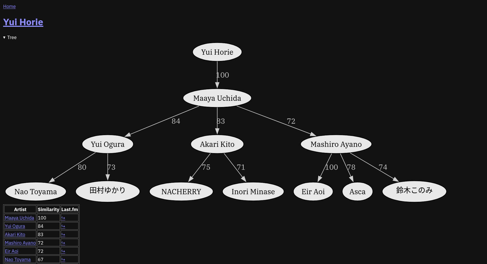

# lasttree

## Motivation

- Last.fm has a decent [API](https://www.last.fm/api/show/artist.getSimilar)
  for music discovery
- the [frontend](https://www.last.fm/music/Metallica/+similar) implementation
  of said API is frankly dreadful, since it's just a boring flat list that
  isn't visual in the slightest

This project aims to do something about it, while also scratching a few itches
of mine at present:

- web development in Rust
- HTMX
- SQL
- graph visualisation and traversal
